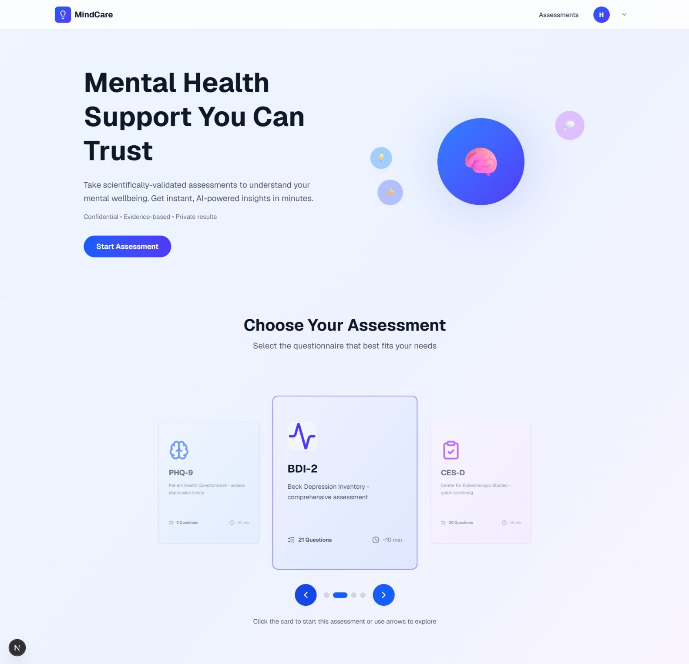
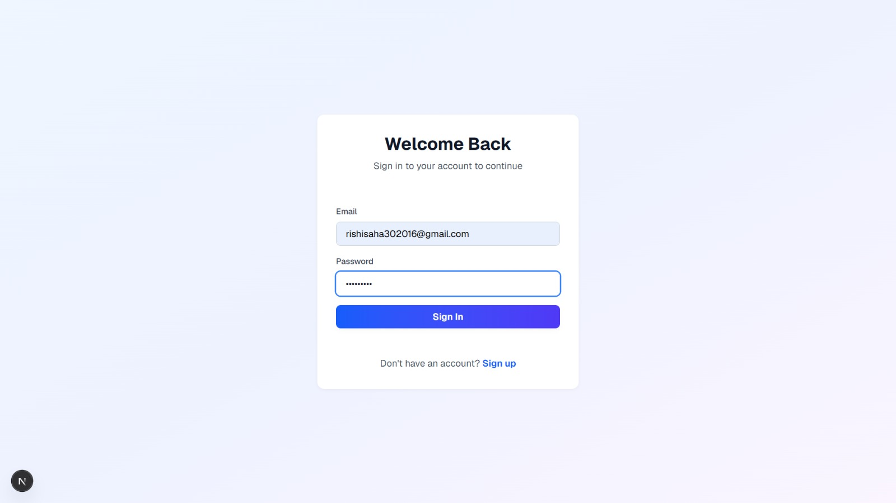
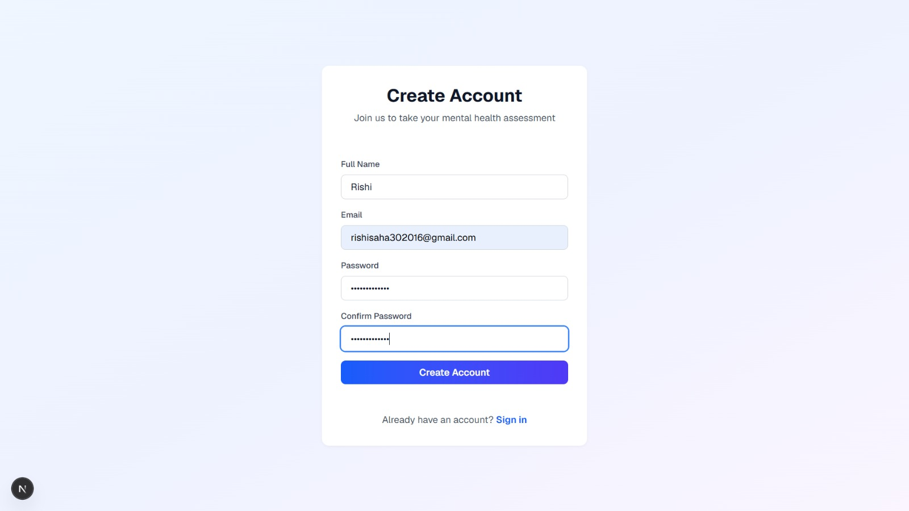
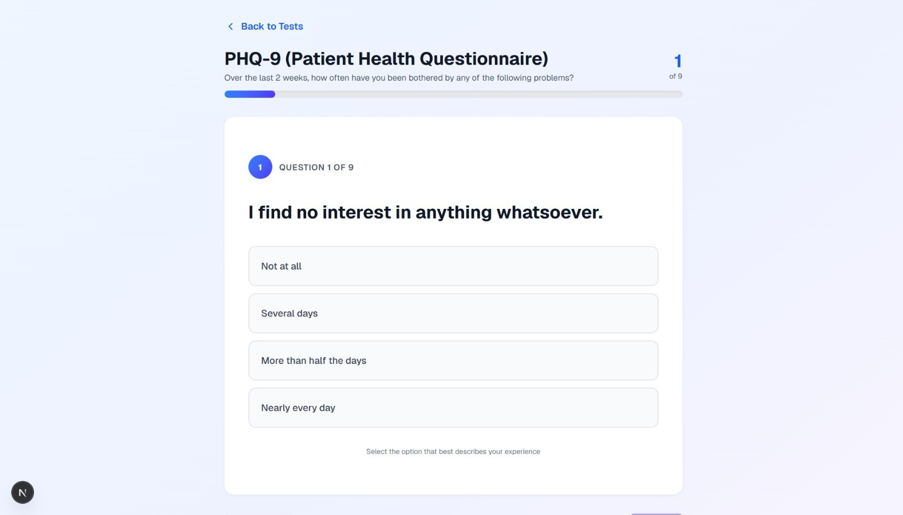
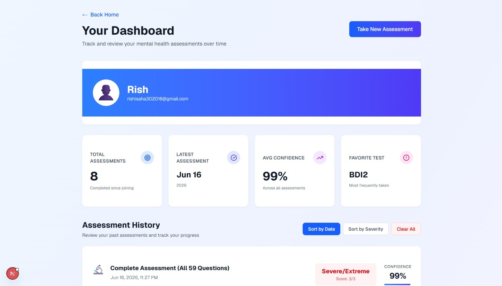

# Depression Severity Screening System

A full-stack web application that combines validated psychological assessment questionnaires with machine learning models to screen depression severity and generate AI-assisted mental health recommendations.

> Final Year B.Tech Project — Computer Science & Engineering, MAKAUT

> This project is intended for educational and research purposes only. It is not a substitute for professional medical diagnosis.

---

## Live Demo

Frontend:
https://depressionfrontend.vercel.app/

> **Note**
>
> The frontend is hosted on Vercel and the backend on Render's free tier.
> If the backend has been inactive, the first request may take approximately 1–2 minutes while the server starts. Subsequent requests are significantly faster.

---

## Demonstration


---

## Screenshots

### Landing Page



Users can choose between multiple validated depression assessment questionnaires.

### Authentication

| Login | Registration |
|--------|--------------|
|  |  |

JWT-based authentication allows users to securely save and access their assessment history.

### Assessment Interface



Interactive questionnaire interface with progress tracking and one-question-at-a-time navigation.

### Dashboard



Review previous assessments, confidence scores, AI recommendations, and assessment history.

---

## Features

- User registration and authentication using JWT
- PHQ-9 assessment
- BDI-II assessment
- CES-D assessment
- Complete combined assessment
- Machine learning-based depression severity prediction
- AI-generated mental health recommendations
- Assessment history
- Dashboard with historical results
- Responsive user interface
- RESTful backend API

---

## Machine Learning

The application predicts depression severity using supervised machine learning models trained on a student mental health dataset.

Supported assessment scales:

- PHQ-9
- BDI-II
- CES-D

Models evaluated:

- Logistic Regression
- Random Forest
- Support Vector Machine (SVM)

Predictions include severity levels and confidence scores, followed by personalized recommendations generated by a language model.

---

## System Architecture

```text
                Next.js Frontend
                       │
                       ▼
               Flask REST API
                       │
        ┌──────────────┼──────────────┐
        ▼              ▼              ▼
 Authentication   ML Prediction   Recommendation
        │
        ▼
     MongoDB
```

---

## Technology Stack

| Layer | Technologies |
|--------|--------------|
| Frontend | Next.js, React, TypeScript, Tailwind CSS |
| Backend | Flask, Python |
| Database | MongoDB |
| Machine Learning | Scikit-learn |
| Authentication | JWT |
| Deployment | Vercel, Render |

---

## Local Installation

### Backend

```bash
cd backend

python -m venv venv

pip install -r requirements.txt

python run.py
```

### Frontend

```bash
cd frontend

npm install

npm run dev
```

---

## Environment Variables

Backend

```env
MONGO_URI=

JWT_SECRET=

RECOMMENDATION_PROVIDER=

OLLAMA_URL=
```

Frontend

```env
NEXT_PUBLIC_API_URL=
```

---

## API Endpoints

| Method | Endpoint | Description |
|---------|----------|-------------|
| POST | `/auth/signup` | Register a new user |
| POST | `/auth/login` | Authenticate a user |
| POST | `/predictions/predict` | Generate a prediction |
| POST | `/predictions/save` | Save an assessment |
| GET | `/dashboard` | Retrieve assessment history |

Detailed request and response examples are available in `API.md`.

---

## Future Work

- Email verification
- Password reset
- Explainable AI
- Mobile application
- Administrative dashboard

---
## Authors

This project was developed as a Final Year B.Tech Project by:

- **Kushal Karmakar** – [GitHub](https://github.com/Kushal-CSE)
- **Rishi Saha** – [GitHub](https://github.com/myself-Rishi-saha)
- **MD Mehar Belal** – [GitHub](https://github.com/md-mehar-belal)
- **Priartha Sarkar** – [GitHub](https://github.com/Priartha)

**Bachelor of Technology in Computer Science and Engineering**

**Maulana Abul Kalam Azad University of Technology (MAKAUT)**